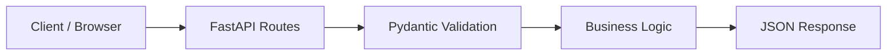

# 📚 Bookstore API


API REST desenvolvida com FastAPI para simular o gerenciamento de uma livraria.  
O projeto consolida fundamentos de construção de serviços HTTP modernos com tipagem forte, validação automática e documentação interativa.

---

# 🎯 Objetivo do Projeto

Consolidar fundamentos de APIs REST utilizando FastAPI:

- Definição de rotas HTTP
- Uso de Type Hints
- Validação automática com Pydantic
- Geração automática de documentação (OpenAPI)
- Execução via servidor ASGI

Este projeto representa a base para arquiteturas mais robustas implementadas nos projetos evolutivos do repositório.

---

# 🚀 Funcionalidades

- 📖 Listagem de livros
- 💳 Simulação de compra
- 📑 Documentação automática via Swagger UI
- 🔎 Validação automática de dados de entrada

---

# 🏗️ Arquitetura

A aplicação segue o modelo padrão de API REST com FastAPI:

Cliente → Endpoint HTTP → Validação (Pydantic) → Lógica → Resposta JSON

## Estrutura Simplificada

```

bookstore/
│
├── books.json
└── main.py

```

## Diagrama Arquitetural



---

# 🛠️ Tecnologias Utilizadas

### Backend

* Python 3.10+
* FastAPI

### Servidor

* Uvicorn (ASGI)

### Validação e Modelagem

* Pydantic
* Type Hints

### Documentação

* OpenAPI
* Swagger UI
* ReDoc

---

# ⚙️ Como Executar

```bash
cd Backend/FastAPI/bookstore
```

Criar ambiente virtual (opcional):

```bash
python -m venv venv
```

Ativar:

Windows:

```bash
.\venv\Scripts\activate
```

Linux/macOS:

```bash
source venv/bin/activate
```

Instalar dependências:

```bash
pip install fastapi uvicorn
```

Executar:

```bash
uvicorn main:app --reload
```

Acessar documentação:

* Swagger UI → [http://127.0.0.1:8000/docs](http://127.0.0.1:8000/docs)
* ReDoc → [http://127.0.0.1:8000/redoc](http://127.0.0.1:8000/redoc)

---

# ⚠️ Limitações Atuais

* Persistência em memória
* Sem banco de dados
* Sem autenticação
* Sem testes automatizados

---