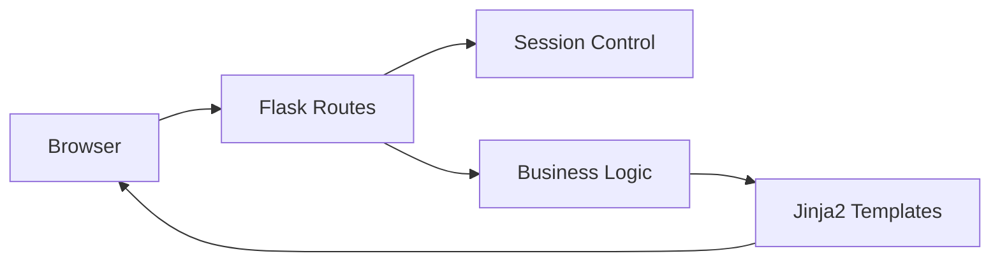

# 🎮 Jogoteca


Aplicação web server-side construída com Flask, com foco na consolidação dos fundamentos de desenvolvimento backend tradicional utilizando renderização de templates no servidor.

O projeto implementa autenticação baseada em sessão, controle de rotas protegidas e organização modular de templates.

---

# 🎯 Objetivo do Projeto

Consolidar conceitos fundamentais de aplicações web server-side:

- Manipulação de rotas HTTP
- Controle de sessão
- Autenticação simples
- Renderização com template engine
- Estrutura MVC simplificada
- Separação entre lógica e apresentação

---

# 🚀 Funcionalidades

- 🔐 Autenticação baseada em sessão
- 📋 Listagem dinâmica de jogos
- ➕ Cadastro de novos títulos
- 💬 Flash messages para feedback
- 🎨 Layout base reutilizável com herança de templates

---

# 🏗️ Arquitetura

A aplicação segue um modelo server-side tradicional:

Cliente → Rota Flask → Lógica de Negócio → Template Jinja2 → Resposta HTML

## Estrutura Simplificada

```

jogoteca/
│
├── templates/
│   ├── lista
│   ├── login
│   ├── novo
│   └── templete
│
├── static/
│   └── arquivos CSS
│
└── jogoteca.py

```

## Diagrama Arquitetural



---

# 🛠️ Tecnologias Utilizadas

### Backend

* Python 3
* Flask

### Template Engine

* Jinja2

### Frontend

* Bootstrap
* HTML5
* CSS3

---

# ⚙️ Como Executar

```bash
cd Backend/Flask/jogoteca
```

Criar ambiente virtual (opcional):

```bash
python -m venv venv
```

Ativar:

Windows:

```bash
.\venv\Scripts\activate
```

Linux/macOS:

```bash
source venv/bin/activate
```

Instalar dependências:

```bash
pip install flask
```

Executar:

```bash
python jogoteca.py
```

Acesse:

```
http://localhost:5000
```

---

# ⚠️ Limitações Atuais

* Persistência apenas em memória
* Sem banco de dados
* Autenticação simplificada
* Sem testes automatizados

---

# 🧭 Roadmap de Evolução

* [ ] Migrar persistência para SQLite
* [ ] Implementar SQLAlchemy
* [ ] Adicionar testes com Pytest
* [ ] Separar aplicação em módulos
* [ ] Containerizar com Docker

---

# 📈 Evolução Dentro do Learning Path

Este projeto representa a base do desenvolvimento backend tradicional (server-side rendering), servindo como fundamento para arquiteturas mais avançadas implementadas nos projetos com FastAPI.

---