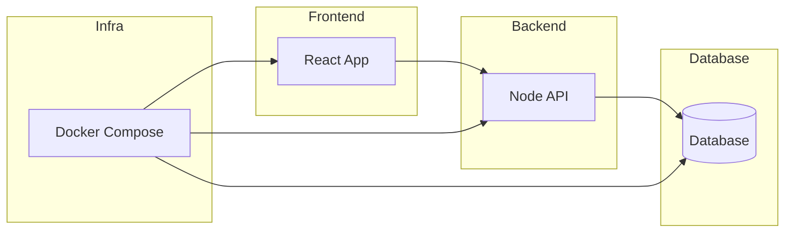

# 🐳 Docker Lab


Ambiente de experimentação focado em containerização, orquestração de serviços e consolidação de práticas de infraestrutura utilizando Docker e Docker Compose.

Este diretório funciona como laboratório prático para construção de imagens, gerenciamento de containers, persistência de dados e execução de aplicações full stack em ambiente isolado.

---

# 🎯 Objetivo do Projeto

Consolidar conhecimentos em:

- Criação de imagens com Dockerfile
- Gerenciamento de containers
- Uso de volumes para persistência
- Configuração de redes entre serviços
- Orquestração com Docker Compose
- Execução de aplicações full stack containerizadas

---

# 🚀 Projetos Desenvolvidos

## 🔹 [Aplicação Node.js](./app/)

Projeto focado nos fundamentos de containerização.

**Conceitos aplicados:**
- Construção de imagem customizada
- Versionamento com tags
- Execução em modo detached
- Persistência com volumes nomeados

---

## 🔹 [Clone Netflix (Full Stack)](./netflix/)

Stack completa orquestrada com Docker Compose.

**Arquitetura:**
- Backend: Node.js
- Frontend: React
- Banco de dados
- Comunicação via rede interna do Compose

**Conceitos aplicados:**
- Orquestração multi-serviço
- Variáveis de ambiente
- Mapeamento de portas
- Build automático via `docker compose up --build`

---

# 🏗️ Arquitetura de Orquestração



Fluxo:

Usuário → Frontend → Backend → Banco
Infraestrutura gerenciada via Docker Compose.

---

# 🛠️ Tecnologias Utilizadas

### Containerização

* Docker Engine
* Docker Desktop
* Docker Hub

### Orquestração

* Docker Compose

### Aplicações Base

* Node.js
* React

### Ambiente

* Linux (ambiente containerizado)

---

# ⚙️ Comandos Essenciais Praticados

### Containers e Imagens

```bash
docker run -d imagem:tag
docker ps -a
docker stop <container>
docker rm -f <container>
docker build -t nome:tag .
```

### Volumes

```bash
docker volume inspect nome-volume
docker run -v volume:/app/dados imagem
```

### Docker Compose

```bash
docker compose up
docker compose up --build
docker compose down
docker compose ps
```

---

# ⚠️ Limitações Atuais

* Sem pipeline CI/CD
* Sem deploy em ambiente cloud
* Sem monitoramento ou logs estruturados
* Sem testes automatizados de integração

---

# 📈 Evolução Dentro do Learning Path

Este laboratório representa a consolidação da camada de infraestrutura do repositório, permitindo que projetos backend e frontend sejam executados em ambientes reproduzíveis e prontos para produção.

---