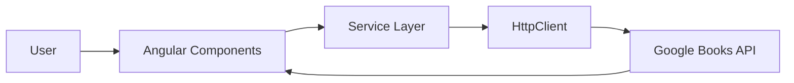

# 🔎 Buscante


Aplicação frontend desenvolvida em Angular para pesquisa e descoberta de livros utilizando a Google Books API.

O projeto foca em consumo de APIs externas, arquitetura baseada em componentes e implementação de boas práticas de acessibilidade.

---

# 🎯 Objetivo do Projeto

Consolidar conceitos modernos de desenvolvimento frontend:

- Consumo de API REST
- Programação reativa com RxJS
- Componentização
- Gerenciamento de estado assíncrono
- Acessibilidade (WCAG / ARIA)
- Boas práticas de UX

---

# 🚀 Funcionalidades

- 🔍 Pesquisa dinâmica de livros
- 📖 Visualização detalhada de obra
- 📝 Exibição de título, autoria e sinopse
- 🔗 Link para prévia do livro
- ♿ Melhorias de acessibilidade (navegação e foco)

---

# 🏗️ Arquitetura

A aplicação segue o padrão SPA (Single Page Application):

Usuário → Componente Angular → Service → HTTP Client → Google Books API → Resposta → Atualização reativa da UI

## Estrutura Simplificada

```

buscante/src
│
├── app/
│  ├── componentes
│  ├── models
│  ├── pages
│  ├── services/
└── assets/

```

## Diagrama Arquitetural



---

# 🛠️ Tecnologias Utilizadas

### Framework

* Angular

### Programação Reativa

* RxJS

### Integração Externa

* Google Books API

### Conceitos Aplicados

* Observables
* Async Pipes
* Componentes reutilizáveis
* Acessibilidade com boas práticas WCAG

---

# ⚙️ Como Executar

```bash
cd Frontend/angular/acessibilidade-angular/a11y-buscante
```

Instalar dependências:

```bash
npm install
```

Executar aplicação:

```bash
ng serve
```

Acessar:

```
http://localhost:4200/
```

---

# ⚠️ Limitações Atuais

* Sem backend próprio
* Dependência direta da API pública
* Sem cache local
* Sem testes automatizados

---


# 📈 Evolução Dentro do Learning Path

Este projeto representa a consolidação do consumo de APIs externas no frontend, preparando a base para integração fullstack com os projetos backend do repositório.

---
