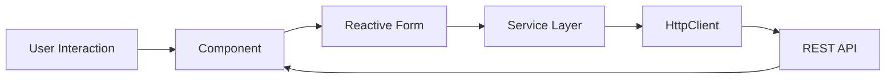

# 📝 MemoTeca


Aplicação SPA desenvolvida em Angular para gerenciamento de pensamentos em formato de mural digital.

O projeto evolui de um CRUD simples para uma aplicação com validações robustas, busca dinâmica, paginação e controle de favoritos com persistência.

---

# 🎯 Objetivo do Projeto

Consolidar conceitos avançados de frontend moderno:

- CRUD completo com API REST
- Reactive Forms
- Comunicação HTTP parametrizada
- Manipulação de estado assíncrono
- Reutilização de componentes
- Organização de regras de negócio em serviços
- UX otimizada com paginação e filtros

---

# 🚀 Funcionalidades

- ➕ Criação de pensamento
- ✏️ Edição
- 🗑️ Exclusão
- 🔍 Busca dinâmica
- 📄 Paginação incremental ("Carregar mais")
- ⭐ Sistema de favoritos com persistência
- ✅ Validações reativas em tempo real

---

# 🏗️ Arquitetura

A aplicação segue padrão SPA com separação clara entre:

UI → Componentes  
Regra de negócio → Services  
Comunicação externa → HttpClient  
Persistência → API REST (JSON Server)

## Estrutura Simplificada

```

memoteca/
│
├── backend/
│  ├── db.json
├── src/
│  ├── app/
│  |  ├── componentes
│  |  |  ├── cabecalho
│  |  |  ├── pensamentos
│  |  |  └── rodape
|  └── assets
└── 

```

## Fluxo de Dados



---

# 🛠️ Tecnologias Utilizadas

### Frontend

* Angular (v14+)
* TypeScript
* RxJS
* Reactive Forms

### Backend (Simulado)

* JSON Server

### Estilização

* CSS customizado
* Bootstrap

---

# ⚙️ Como Executar

Instalar dependências:

```bash
npm install
```

Iniciar backend (em outro terminal):

```bash
cd backend
npm start
```

Executar frontend:

```bash
ng serve
```

Acessar:

```
http://localhost:4200
```

---

# ⚠️ Limitações Atuais

* Backend simulado (não persistente em produção)
* Sem autenticação
* Sem testes automatizados
* Sem gerenciamento de estado global

---


# 📈 Papel Dentro do Ecossistema

O MemoTeca representa o estágio intermediário do frontend no ecossistema do repositório:

Indexa → Estrutura e Componentização
Buscante → Consumo de API Externa
MemoTeca → CRUD Completo + Estado Reativo

Ele serve como base direta para integração fullstack com APIs reais e ambientes containerizados.

---

# 🔎 Posicionamento Estratégico

Agora sua trilha frontend está organizada por complexidade:

| Projeto     | Nível Técnico |
|-------------|---------------|
| Indexa      | Fundamentos de Componentização |
| Buscante    | Consumo de API + RxJS |
| MemoTeca    | CRUD Completo + Arquitetura SPA |

---
