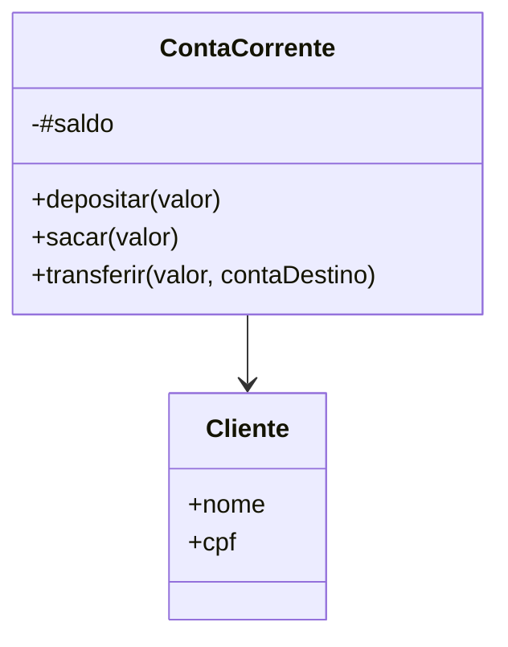

# ☕ JS Banking Domain — Object-Oriented Modeling


Projeto de modelagem de domínio utilizando Programação Orientada a Objetos com JavaScript moderno (ES6+) no ambiente Node.js.

A aplicação simula um sistema bancário simplificado com foco em encapsulamento, integridade de estado e separação de responsabilidades.

---

# 🎯 Objetivo do Projeto

Demonstrar fundamentos sólidos de design orientado a objetos aplicados a um domínio realista:

- Modelagem de entidades
- Encapsulamento com campos privados (`#`)
- Validação de regras de negócio
- Composição entre objetos
- Modularização com ES Modules

---

# 🏗️ Modelagem de Domínio

O domínio representa um sistema bancário simplificado composto por:

- Cliente
- ContaCorrente

## Relacionamento

Uma `ContaCorrente` possui um `Cliente` como titular, representando composição entre entidades.



---

# 🧠 Conceitos Aplicados

## Encapsulamento

Uso de campos privados para proteger estado interno:

```js
#saldo = 0;
```

A manipulação do saldo ocorre exclusivamente por métodos controlados.

---

## Regras de Negócio

Cada operação valida o estado antes de modificá-lo:

* `depositar(valor)` → aceita apenas valores positivos
* `sacar(valor)` → verifica saldo disponível
* `transferir(valor, contaDestino)` → valida origem e destino

Isso impede inconsistências e reforça integridade do modelo.

---

## Modularização

Uso de ES Modules:

* Separação clara entre entidades
* Import/export explícitos
* Organização coesa por responsabilidade

---

# 📂 Estrutura do Projeto

```
js-poo/
│
├── Cliente.js
├── ContaCorrente.js
└── index.js
```

* **Cliente.js** → Entidade de identificação
* **ContaCorrente.js** → Regras bancárias e controle de estado
* **index.js** → Execução e simulação de operações

---

# 🛠️ Tecnologias Utilizadas

* JavaScript (ES6+)
* Node.js
* ES Modules
* Paradigma Orientado a Objetos

---

# ▶️ Como Executar

O projeto utiliza `"type": "module"` no `package.json`.

Executar:

```bash
node index.js
```

---

# 📈 Papel Dentro do Ecossistema

Este projeto representa a base conceitual de modelagem orientada a objetos dentro do ecossistema do repositório.

Enquanto os projetos Angular demonstram arquitetura de interface e consumo de API, este projeto reforça fundamentos de:

* Design de classes
* Integridade de estado
* Organização modular
* Simulação de regras de negócio

Ele serve como base conceitual para aplicações backend mais complexas.

---