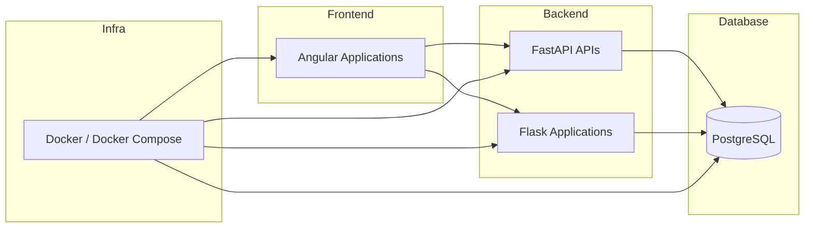

# 🚀 Fullstack Learning Path

Repositório estruturado para consolidar minha evolução como desenvolvedora **Fullstack**, aplicando conceitos de Backend, Frontend e DevOps em projetos progressivamente mais complexos.

O objetivo não é apenas acompanhar cursos, mas transformar cada projeto em um laboratório de engenharia com melhorias incrementais, boas práticas e documentação profissional.

---

# 🎯 Estratégia de Evolução

Cada projeto neste repositório segue princípios consistentes:

- Documentação estruturada
- Roadmap evolutivo
- Separação de responsabilidades
- Aplicação prática de arquitetura
- Evolução além do conteúdo base estudado

A progressão ocorre em três pilares principais:

1. **Backend Engineering**
2. **Frontend Engineering**
3. **DevOps & Infraestrutura**

---

# 🏗️ Arquitetura Global

---

# 🖥️ Backend

## 🔹 [FastAPI Zero](./Backend/FastAPI/fastapi_zero/)
📁 `Backend/FastAPI/fastapi_zero`

API assíncrona construída com foco em arquitetura modular, TDD e boas práticas de segurança.

**Conceitos aplicados:**
- APIRouter para modularização
- Injeção de dependência com `Annotated`
- Configuração via `Pydantic-Settings`
- Autenticação JWT
- Testes automatizados com Pytest
- PostgreSQL + Alembic
- Docker e Docker Compose

🔄 Projeto em evolução contínua.

---

## 🔹[Bookstore API](./Backend/FastAPI/bookstore)
📁 `Backend/FastAPI/bookstore`

API REST para gerenciamento de livros, com foco em fundamentos da construção de serviços HTTP.

**Conceitos aplicados:**
- Type Hints
- Validação com Pydantic
- Documentação automática (Swagger/OpenAPI)
- Estruturação básica de rotas

---

## 🔹 [Jogoteca - Flask](./Backend/Flask/jogoteca/)
📁 `Backend/Flask/jogoteca`

Aplicação web server-side com autenticação baseada em sessão e renderização via Jinja2.

**Conceitos aplicados:**
- Rotas dinâmicas
- Templates com herança
- Controle de sessão
- Flash messages
- Organização MVC simplificada

---

# 🎨 Frontend

## 🔹 [Indexa - Angular](./Frontend/angular/indexa/)
📁 `Frontend/angular/indexa`

Aplicação de agenda de contatos utilizando recursos modernos do Angular.

**Conceitos aplicados:**
- Nova sintaxe de Control Flow (`@for`)
- Componentização
- Manipulação de dados JSON
- Estrutura modular

---

## 🔹 [Buscante - Acessibilidade](./Frontend/angular/acessibilidade-angular/a11y-buscante)
📁 `Frontend/angular/acessibilidade-angular/a11y-buscante`

Projeto com foco em inclusão digital e acessibilidade.

**Conceitos aplicados:**
- WCAG
- ARIA
- `focusTrap`
- `LiveAnnouncer`
- Navegação semântica

---

## 🔹 [Memoteca - Angula](./Frontend/angular/memoteca/)
📁 `Frontend/angular/memoteca`

CRUD evolutivo em Angular com foco em validações e experiência do usuário.

**Conceitos aplicados:**
- Reactive Forms
- Validações customizadas
- Paginação
- Filtros
- Favoritos

---

## 🔹 [JavaScript OO](./Frontend/javascript/js-poo/)
📁 `Frontend/javascript/js-poo`

Fundamentos de Programação Orientada a Objetos aplicados em JavaScript.

**Conceitos aplicados:**
- Classes
- Encapsulamento
- Atributos privados
- Composição

---

# 🏗️ DevOps & Infraestrutura

## 🔹 [Docker Lab](./DevOps/docker/)
📁 `DevOps/docker`

Ambiente de experimentação e consolidação de conceitos de containerização.

**Conceitos aplicados:**
- Dockerfile
- Docker Compose
- Orquestração de múltiplos serviços
- Volumes para persistência
- Redes entre containers
- Ciclo de build → run → teardown

---

# 🛠️ Stack Tecnológica

### Linguagens
- Python
- TypeScript
- JavaScript
- HTML / CSS

### Backend
- FastAPI
- Flask
- SQLAlchemy
- Alembic

### Frontend
- Angular (v14–v18)
- Angular CDK

### DevOps
- Docker
- Docker Compose

### Ferramentas
- Git & GitHub
- Poetry
- Taskipy
- Pytest

---

# 🧭 Roadmap Global

- [x] APIs REST síncronas
- [x] APIs assíncronas
- [x] Autenticação JWT
- [x] PostgreSQL
- [x] Docker
- [ ] CI/CD (GitHub Actions)
- [ ] Deploy Cloud
- [ ] Observabilidade e logs estruturados
- [ ] Integração Fullstack (Frontend + Backend em produção)

---

# 📈 Objetivo Profissional

Este repositório representa minha evolução técnica estruturada, consolidando conhecimentos práticos e ampliando cada projeto com melhorias arquiteturais e boas práticas de engenharia.

---

Desenvolvido por **Michelly Crystiane**